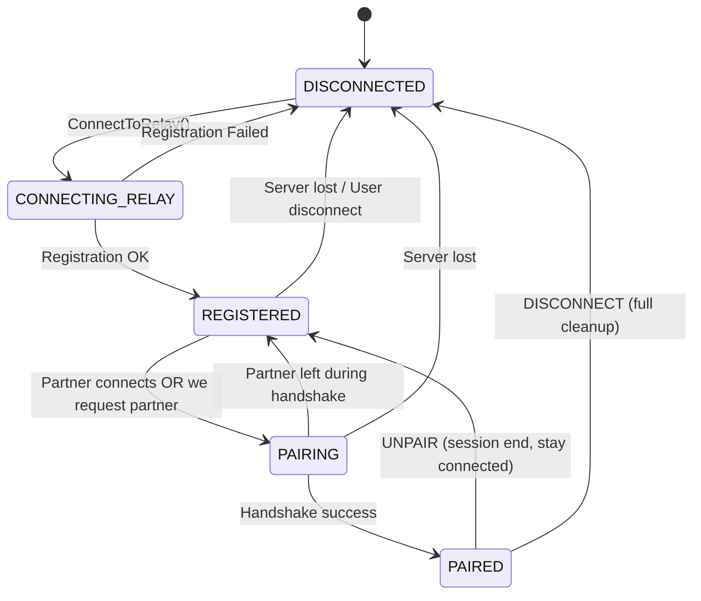
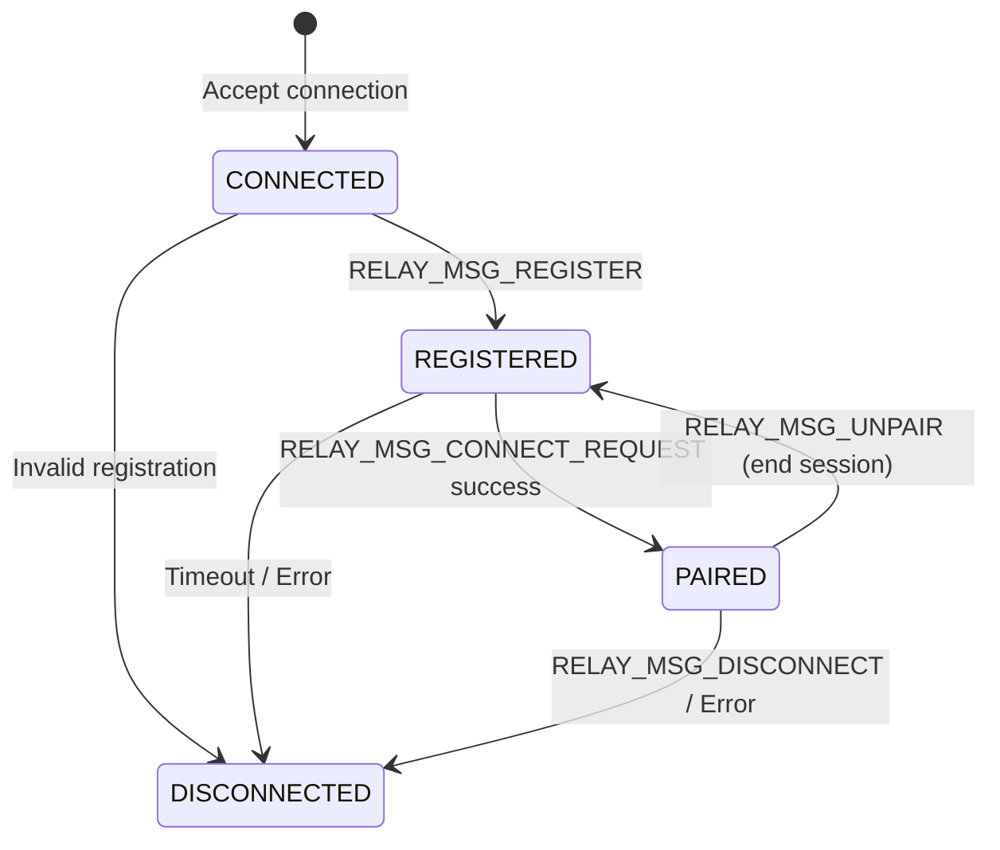
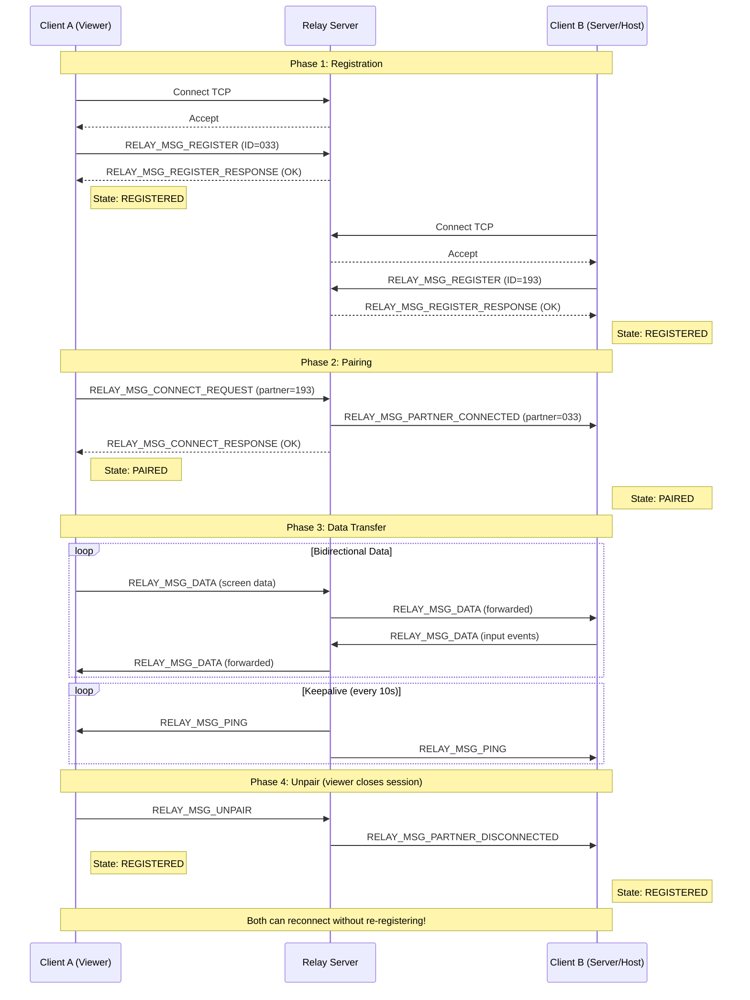
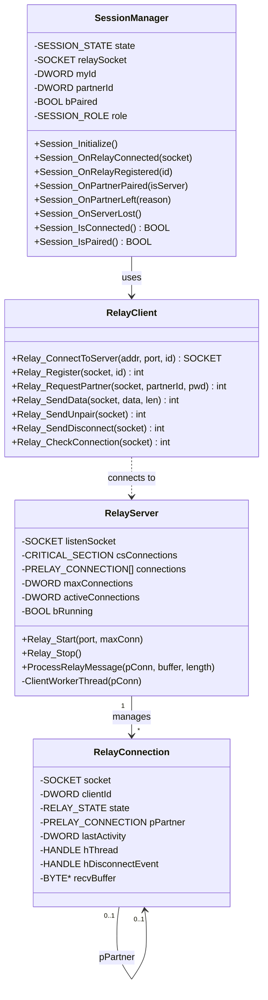

# RemoteDesk2K Relay Architecture

## Overview
This document describes the relay connection architecture used for NAT traversal.
The relay server acts as a middleman to connect clients behind different NATs.

---

## 1. State Machine Diagram

### Client States


### Server States (per connection)


---

## 2. Sequence Diagram: Connection Flow



---

## 3. Class Diagram



---

## 4. Message Protocol

### Relay Header (8 bytes)
```
+----------+-------+----------+------------+
| msgType  | flags | reserved | dataLength |
| (1 byte) |(1 byte)| (2 bytes)| (4 bytes)  |
+----------+-------+----------+------------+
```

### Message Types
| Code | Name | Direction | Description |
|------|------|-----------|-------------|
| 0x50 | REGISTER | C→S | Register client ID with relay |
| 0x51 | CONNECT_REQUEST | C→S | Request pairing with partner |
| 0x52 | CONNECT_RESPONSE | S→C | Pairing result |
| 0x53 | DATA | C↔C | Tunneled application data |
| 0x54 | DISCONNECT | C→S | Full disconnect (close socket) |
| 0x55 | PING | S→C / C→S | Keepalive |
| 0x56 | PONG | S→C / C→S | Keepalive response |
| 0x57 | PARTNER_DISCONNECTED | S→C | Partner left notification |
| 0x58 | REGISTER_RESPONSE | S→C | Registration result |
| 0x59 | PARTNER_CONNECTED | S→C | Partner connected notification |
| **0x5A** | **UNPAIR** | C→S | **End session, stay REGISTERED** |

---

## 5. Key Design Decisions

### 5.1 UNPAIR vs DISCONNECT
- **DISCONNECT (0x54)**: Completely leave relay server (socket closes)
- **UNPAIR (0x5A)**: End current pairing but stay REGISTERED

When viewer closes, we send UNPAIR so both clients return to REGISTERED
and can immediately reconnect without re-registering.

### 5.2 Keepalive Strategy
1. **Server-initiated**: Server sends PING every 10 seconds
2. **Dead detection**: If send() fails, socket is dead → cleanup
3. **Timeout**: 30 seconds for REGISTERED, 5 minutes hard limit for PAIRED

### 5.3 State Transitions
All state changes go through SessionManager to ensure:
- Thread-safe state updates
- Timers started/stopped appropriately
- Callbacks notify UI
- No duplicate states

---

## 6. Error Handling

| Error | Detection | Action |
|-------|-----------|--------|
| Network drop | send() fails | Cleanup, notify partner |
| Client crash | Keepalive timeout | Server detects, unpairs |
| Server crash | recv() returns 0 | Client goes DISCONNECTED |
| Partner left | PARTNER_DISCONNECTED msg | Return to REGISTERED |
| Duplicate ID | REGISTER_RESPONSE error | Reject new connection |

---

## 7. Files

| File | Role |
|------|------|
| `relay.c` | Server implementation (Windows/Linux) |
| `relay_client.c` | Client-side relay API |
| `session_manager.c` | Client state machine |
| `common/relay.h` | Protocol definitions |
| `network.c` | Low-level socket operations |

---

*Last updated: February 2026*
